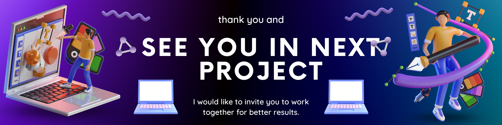

# 👀About Me
hello i'm a frond end developer👨🏻‍💻🔥 I am a undergradde at UPN "Veteran" East Java in the Informatics Study Program,  I focus on Front-end Web Developer and I am also learning about data science and  I am still growing in progress, enthusiasm📊

## 🌐 Let's Connect With Me

  

# 💻 Tech Stack Leaning
<h3 align="left">Languages and Tools:</h3>

                       

 📊 GitHub Stats
 
 
 
 

Screenshots of Features ✨
  
 
  

## 🏆 GitHub Trophies

### ✍️ Random Developer Quote

### 🔝 Top Contributed Repo

#
<!-- Proudly created with GPRM ( https://gprm.itsvg.in ) -->

---
<picture>
  <source media="(prefers-color-scheme: dark)" srcset="https://raw.githubusercontent.com/tobiasmeyhoefer/tobiasmeyhoefer/output/github-snake-dark.svg" />
  <source media="(prefers-color-scheme: light)" srcset="https://raw.githubusercontent.com/tobiasmeyhoefer/tobiasmeyhoefer/output/github-snake.svg" />
  
</picture>

